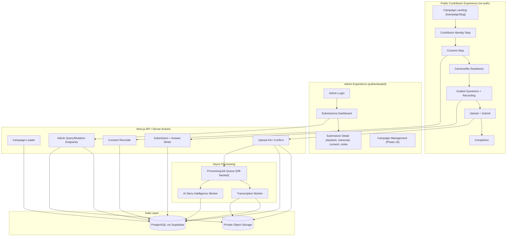

# Architecture — Coleman Storybook V1

Status: DRAFT — Phase 1
Deliver target: `PHASE_1_ARCHITECTURE_READY_FOR_IMPLEMENTATION`

## 1. Stack Decision

| Layer | Choice | Status |
|---|---|---|
| Framework | Next.js (App Router) + TypeScript | Recommended, adopted |
| UI | React + Tailwind CSS | Recommended, adopted |
| Database | PostgreSQL | Recommended, adopted |
| Backend/managed services | Supabase (Postgres + Auth + Storage) | Recommended, adopted for V1 |
| Object storage | Supabase Storage (private buckets) | Adopted for V1; R2/S3 documented as swap-in alternative |
| Admin auth | Supabase Auth (email/password or magic link), scoped to an `admin_users` allowlist | Adopted for V1 |
| Video capture | Browser-native `MediaRecorder` + `getUserMedia` | Adopted |
| Transcription | Provider-abstracted interface; initial implementation via a hosted speech-to-text API (e.g., a Whisper-API-compatible provider) | Interface adopted now; provider selection deferred to Phase 8 to avoid picking a vendor before a key is needed |
| AI analysis | Provider-abstracted interface; initial implementation via a hosted LLM API with structured/JSON output | Interface adopted now; provider selection deferred to Phase 9 |
| Email | Provider-abstracted; Resend as initial candidate | Deferred until Phase 6+ needs transactional email (submission confirmation) |
| Analytics | Lightweight custom event table in Postgres for V1; PostHog documented as a drop-in upgrade | Adopted (custom table) to avoid an extra vendor before there's traffic to analyze |
| Deployment | Vercel (app) + Supabase (data/storage/auth) | Recommended; not provisioned until Phase 13/14 |

**Rationale for "fewer infrastructure vendors during MVP":** Supabase bundles Postgres, auth, and object storage behind one account and one set of credentials, which materially reduces Phase 5 (storage) and Phase 7 (admin auth) complexity versus hand-rolling S3 + a separate auth provider + a separate Postgres host. If Camp Coleman's real usage or cost profile later argues for Cloudflare R2 (cheaper egress) or a different auth provider, the storage and auth layers are each isolated behind an adapter interface (see Section 4) specifically so that swap is a config/adapter change, not a rewrite.

**Alternative considered — hand-rolled Postgres (e.g., Neon/RDS) + S3 + NextAuth:**
- *Advantages:* more control, avoids Supabase platform lock-in, potentially cheaper at large scale.
- *Disadvantages:* three vendors instead of one, more glue code, more Phase 5/7 implementation surface for a V1 with unknown volume.
- *Migration implications:* moderate — the storage and auth adapters are designed to make this swap possible later; the database itself is plain Postgres either way (no Supabase-specific schema features used), so a `pg_dump`/`pg_restore` migration path exists.
- *Recommendation:* stay with Supabase for V1; revisit if cost or platform limitations become evidenced problems (see `docs/cost-model.md`).

## 2. Tenancy Strategy

A lightweight `Organization` and `OrganizationBrand` concept exists from day one so nothing is hard-coded to "Camp Coleman" in application logic. This is **multi-organization ready**, not full multi-tenant SaaS:
- No per-organization billing, provisioning UI, or tenant admin console in V1.
- Row-level `organization_id` scoping exists on every organization-owned table so a second organization could be added later without a schema migration, but V1 ships with exactly one seeded organization (Camp Coleman) and no UI to create additional ones.
- Authorization checks are already organization-scoped (an admin's access is tied to an organization), which also happens to be good practice for a single-tenant deployment (defense in depth).

## 3. Component Architecture



**Processing worker note:** V1 implements `ProcessingJob` as a DB-backed queue polled by a Next.js API route invoked on a schedule (e.g., Vercel Cron) rather than standing up a separate worker service. This avoids adding a message-queue vendor before volume justifies one, while keeping the job/state model identical to what a real queue would need if volume grows (see Section 6, Revisit When).

## 4. Provider Abstraction Pattern

Storage, transcription, AI analysis, and email each get a small TypeScript interface plus one concrete implementation, so swapping providers later means writing a new implementation, not touching call sites.

```ts
// storage/adapter.ts
interface MediaStorageAdapter {
  createUploadTarget(key: string, contentType: string): Promise<{ uploadUrl: string; token?: string }>;
  confirmUpload(key: string): Promise<{ bytes: number; contentType: string }>;
  getSignedReadUrl(key: string, expiresInSeconds: number): Promise<string>;
  deleteObject(key: string): Promise<void>;
}

// transcription/adapter.ts
interface TranscriptionProvider {
  transcribe(input: { mediaUrl: string }): Promise<{
    text: string; segments: { start: number; end: number; text: string }[];
    provider: string; model: string; raw: unknown;
  }>;
}

// analysis/adapter.ts
interface StoryAnalysisProvider {
  analyze(input: { transcriptText: string }): Promise<{
    summary: string; themes: string[]; pullQuotes: { text: string; startTime?: number; endTime?: number }[];
    marketingUseSuggestions: string[]; provider: string; model: string; raw: unknown;
  }>;
}
```

Each adapter's `raw` output is persisted (see `StoryAnalysis.rawResponse`, `Transcript.rawResponse` in the data model) so results can later be regenerated or audited without re-calling the vendor, satisfying the "preserve provenance" requirement.

## 5. Data Model (Summary)

Full field-level detail lives in `docs/data-model.md` (Phase 1/3). Entities:

- **Organization** — id, name, slug, config (JSON: contact info, defaults).
- **OrganizationBrand** — organization_id, colors/fonts/logo refs (all nullable/placeholder-safe), name override ("Coleman Storybook" default).
- **AdminUser** — id, organization_id, auth provider identity (Supabase user id), role (single `admin` role in V1 — no complex RBAC), active flag.
- **Campaign** — id, organization_id, slug, title, description, audience config, hero/intro copy, recording_mode (`quick_answers` | `guided_story`), max_duration_seconds, consent_version_id, tags, completion_copy, active boolean.
- **CampaignQuestion** — id, campaign_id, audience (nullable = all audiences), prompt_text, order, active boolean. Deliberately a simple ordered list with an optional audience filter — **not** a rules engine (per spec Section 8).
- **Contributor** — id, organization_id, first_name, last_name, email (nullable — not required to submit), relationship (`camper` | `staff` | `camper_staff` | `parent` | `alumni_parent` | `volunteer` | `other`), years_associated, role_info (free text, optional).
- **Submission** — id, campaign_id, contributor_id, state (see Section 6), recording_mode, created_at, submitted_at, editorial_state (separate from processing state — see Section 6).
- **SubmissionAnswer** — id, submission_id, campaign_question_id (nullable for Guided Story's single continuous recording), order.
- **MediaAsset** — id, submission_answer_id (or submission_id for Guided Story), storage_key, mime_type, duration_seconds, byte_size, checksum, is_original boolean (protects against derivative-clip features overwriting originals in future Phase 17 work).
- **ConsentRecord** — id, submission_id, consent_version, consent_text_reference, accepted_at, acceptance_ip_hash (not raw IP — see Security), user_agent, permitted_use_classification, revoked_at (nullable).
- **Transcript** — id, media_asset_id, text, segments (JSON), provider, model, raw_response (JSON), created_at.
- **StoryAnalysis** — id, submission_id (analysis operates at story level, aggregating transcripts across a submission's answers), summary, themes (array), pull_quotes (JSON), marketing_use_suggestions (array), provider, model, raw_response (JSON), generated_at, superseded_by (nullable — supports regeneration without deleting history).
- **Tag** — id, organization_id, label, kind (`ai_theme` | `manual`).
- **SubmissionTag** — submission_id, tag_id.
- **AdminReview** — id, submission_id, admin_user_id, editorial_state (`approved` | `rejected` | `pending`), notes, favorite boolean, reviewed_at.
- **ProcessingJob** — id, submission_id, job_type (`transcription` | `analysis`), status (`queued` | `running` | `succeeded` | `failed`), attempts, last_error, updated_at.
- **AuditEvent** — id, organization_id, actor_type (`contributor` | `admin` | `system`), actor_id (nullable), event_type, subject_type, subject_id, metadata (JSON), created_at.

**Notably not built as separate tables in V1:** a generic "campaign builder" page schema, a full CMS, or a vector-embeddings table (deferred — see Section 9).

## 6. State Models

Two intentionally separate state machines, per the spec's explicit instruction not to collapse this into ambiguous booleans:

**Submission lifecycle (`Submission.state`):**
```
STARTED -> RECORDING -> UPLOADING -> SUBMITTED -> PROCESSING -> READY_FOR_REVIEW
                                                 -> PROCESSING_FAILED (retryable -> PROCESSING)
SUBMITTED, READY_FOR_REVIEW, PROCESSING_FAILED -> WITHDRAWN (contributor/admin-initiated, future)
```
A submission is only ever visible to admins as "submitted" once `SUBMITTED` is durably persisted server-side — never optimistically on the client.

**Editorial state (`AdminReview.editorial_state`):** independent of processing —
```
PENDING -> APPROVED
PENDING -> REJECTED
APPROVED <-> REJECTED (admin can change their mind)
```
AI analysis never writes to `editorial_state`. Only an authenticated admin action can.

**ProcessingJob status** is per-job (transcription and analysis are separate jobs), so a failed analysis doesn't block a successful transcript from being visible, and admins see exactly which step failed and whether retry is possible (surfaced via `ProcessingJob.last_error` + a retry action).

## 7. Upload Flow

1. Contributor completes a question's recording locally (client-side `MediaRecorder` blob, held in memory/IndexedDB — not yet uploaded).
2. On "approve and continue" (or at final submit for Guided Story), client requests an upload target: `POST /api/uploads/init` with `{ submissionAnswerId, mimeType, estimatedBytes }`.
3. Server validates: submission belongs to an active campaign, campaign not disabled, contributor identity + consent already recorded, mime type in an allowlist (video/webm, video/mp4, audio fallback types), estimated size under a configured cap. Server creates a `MediaAsset` row in a `pending` sub-state and returns a signed upload URL from the storage adapter.
4. Client uploads directly to storage using the signed URL (progress reported via XHR/fetch upload events), avoiding routing large video payloads through the Next.js server function (important for Vercel function payload/time limits).
5. On upload completion, client calls `POST /api/uploads/confirm` with the storage key. **Server re-verifies the object actually exists in storage and matches expected content-type/size bounds before marking anything durable** — the client's claim of "upload finished" is never trusted alone.
6. Only after server-side confirmation does the submission's per-answer state advance. The overall `Submission.state` only reaches `SUBMITTED` once all required answers have confirmed media (or, for Guided Story, the single recording has confirmed media) — this is what prevents "false success" messaging.
7. `ProcessingJob` rows (`transcription`, then `analysis` once transcription succeeds) are enqueued at this point.

Interrupted/failed uploads leave the `MediaAsset` in a non-durable sub-state; the client is told to retry, and no `Submission.state` transition to `SUBMITTED` occurs. Retake before upload confirmation simply discards the local blob client-side — no server state exists yet to clean up.

## 8. Auth & Route Boundaries

- **Public routes** (`/[campaignSlug]/*`, `/api/campaigns/*` read, `/api/consent`, `/api/uploads/*`, `/api/submissions/*` create): no authentication; every write is scoped to a specific, currently-active campaign and validated server-side. Rate limiting applied per-IP and per-contributor-email on submission-creation endpoints to reduce abuse.
- **Admin routes** (`/admin/*`, all admin `/api/admin/*`): require a valid Supabase Auth session AND a matching active `AdminUser` row scoped to the organization. Middleware rejects unauthenticated requests before any handler logic runs (fail closed).
- **Media access:** raw storage objects are never public. All admin media playback goes through a signed, time-limited URL generated server-side after the admin-auth check — this also closes the insecure-direct-object-reference risk (an admin can't guess another organization's storage key and get a working URL, since the signing endpoint re-checks authorization for the specific `MediaAsset`, not just "is this user an admin somewhere").

## 9. Search Strategy

V1 uses Postgres full-text search (`tsvector` column on `Transcript.text` + `StoryAnalysis.summary`/`themes`, combined with standard indexed filters on campaign/audience/year/status/theme/favorite). This is sufficient for the expected V1 corpus size (hundreds, not millions, of submissions) and avoids standing up vector infrastructure before there's a proven need.

**Semantic search upgrade path (documented, not built):** add a `pgvector` extension (Supabase supports this natively), an `embedding` column on `Transcript`/`StoryAnalysis` populated by a background job using a standard embedding model, and a similarity-search query path alongside (not replacing) full-text search. Because `raw_response`/provenance fields already exist, backfilling embeddings for historical submissions is a straightforward batch job, not a data-model migration.

## 10. Analytics Events

Stored in a simple `AnalyticsEvent` table (organization_id, event_type, campaign_id nullable, submission_id nullable, occurred_at, metadata JSON with **no testimonial content**): `campaign_viewed`, `story_started`, `consent_completed`, `permissions_requested`, `permissions_granted`, `permissions_denied`, `recording_started`, `recording_completed`, `recording_retaken`, `upload_started`, `upload_completed`, `upload_failed`, `submission_completed`, `submission_failed`.

## 11. Threat Model (Summary — full detail in `docs/security.md`, Phase 1/12)

| Threat | Mitigation |
|---|---|
| Public access to raw testimonial video | Private storage only; signed URLs generated server-side post-auth-check |
| Insecure direct object reference (guessing another submission's media/ID) | Every admin data-access query is scoped by organization + explicit ownership check, not just "is authenticated" |
| Fake "submission succeeded" due to trusting client | Server-side confirm step re-verifies object existence before state transition |
| Abuse / spam submissions | Rate limiting on public write endpoints; campaign must be active; basic bot-resistance (deferred CAPTCHA decision — see unresolved decisions) |
| Oversized/malicious file upload | MIME allowlist, size cap, duration cap enforced server-side (not just client-side) |
| Secret leakage to browser | All provider API keys (transcription, AI, storage service-role) used only in server contexts; only public/anon Supabase keys with row-level-security ever reach the client |
| Admin privilege escalation | AdminUser rows are provisioned manually/by seed in V1 (no self-serve admin signup) |
| Consent record tampering | ConsentRecord rows are append-only from the API's perspective (no update endpoint; revocation is a new row/flag, not an edit) |
| Logging sensitive content | Structured logs include IDs/state transitions, not transcript or media content |

## 12. Test Strategy

- **Unit:** state-machine transition logic, consent-versioning logic, question/audience selection logic.
- **Component:** recording controls (start/stop/timer/retake), consent screen, upload progress states.
- **Integration:** upload-init/confirm against a real (test) storage bucket; submission creation against a real (test) Postgres instance; processing-job worker against mocked transcription/AI providers.
- **End-to-end (critical paths, per spec Section 30):** happy path, permission denied, retake, upload failure (no false success), disabled campaign, unauthenticated admin access, private media (unauthenticated fetch of a signed-URL-protected object fails), processing failure surfaced in admin, consent trace remains attached to submission.

## 13. Deployment Topology (planned, not provisioned)

Vercel (Next.js app, cron for job polling) + Supabase (Postgres, Auth, Storage), single environment for V1 (with a separate local/dev Supabase project for development — no shared dev/prod credentials). Full checklist in `docs/production-launch-checklist.md` (Phase 13).

## 14. Unresolved Decisions (for Phase 1 progression / owner awareness, not blockers)

- Exact transcription and AI-analysis vendors (deferred to Phase 8/9 — avoids requesting API keys before they're needed).
- Whether basic bot-resistance (e.g., a lightweight CAPTCHA or honeypot field) is needed for V1 public submission endpoints given expected low volume and personal invitation-based distribution — leaning toward honeypot + rate-limit only for V1, full CAPTCHA deferred unless abuse is observed.
- Whether Camp Coleman wants a subdomain (e.g., `stories.campcoleman.org`) — a DNS/domain decision requiring owner input, deferred to Phase 13.
- Final admin-authentication mechanism if Coleman prefers Google Workspace SSO over Supabase email/magic-link (functionally swappable later; V1 assumes Supabase Auth).
